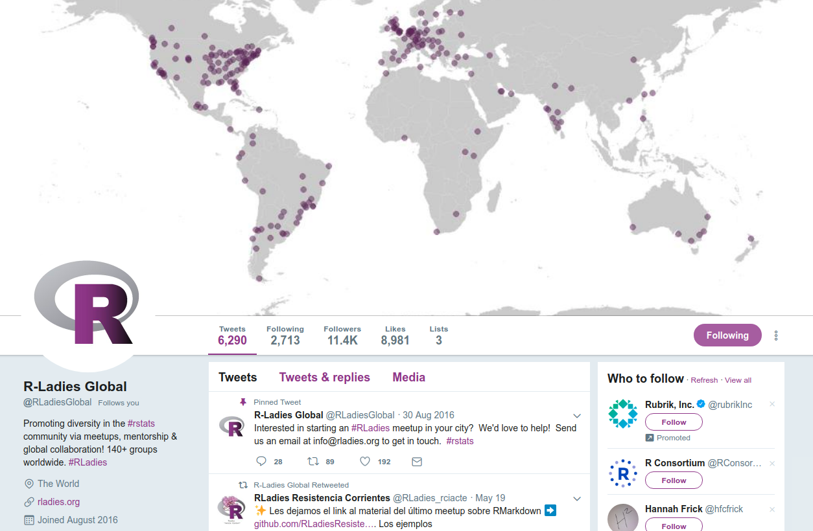
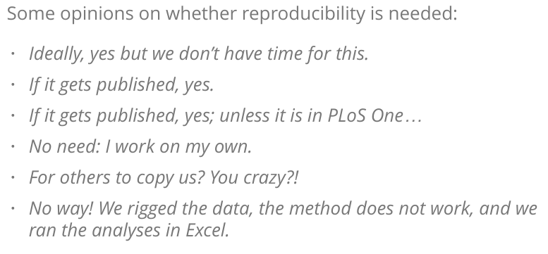
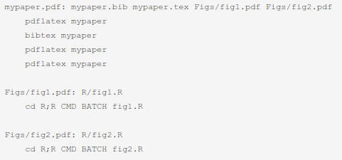

```{r setup, include=FALSE}
options(htmltools.dir.version = FALSE)
```

# Acknowledging

R-Ladies Melbourne for the invitation to speak   

R-Ladies community - welcoming and inclusive

```{r echo=FALSE}

```

---
```{r echo=FALSE}
knitr::include_graphics("https://medicine.unimelb.edu.au/__data/assets/image/0008/2892185/varieties/medium.jpg")
```

The University of Melbourne Centre for Cancer Research, [Genomics Platform Group](https://umccr.org/)

Focus  
- better detection of changes in cancer genomes

---
# Why reproducibility?

--

``` {r, echo=FALSE}

```


(HT [Thibaut Jombart](https://www.reconlearn.org/slides/reproducibility/reproducibility.html#4))

---
# First goal of this talk!

--

<blockquote class="twitter-tweet"><a href="https://twitter.com/trevorabranch/status/648987799648014336"></a></blockquote>

--

**reproducible** and **reuseable** and **transparent**


---

background-image: url("https://media.giphy.com/media/f4FKTFwMXn1za/giphy.gif")
background-position: 50% 50%
class: center, inverse

# Second goal of this talk!

Inspired and confident to dive in!


---

# Assumptions

* You are using RStudio (Integrated Developer Environment)

* You have heard of git

* Familiar with HTML and CSS

---
class: center, inverse, middle

# The evolution of reproducibility in R

---

```{css, echo = FALSE}
@import url(https://fonts.googleapis.com/css?family=Permanent+Marker);
```


# In the beginning, there was LaTeX

<span style="font-family:Permanent Marker">In the early 1980's, LaTex was released.  
[Latex](http://nitens.org/taraborelli/latex) is a document preparation system.  
Plain text + markup = defined structure (article, letter, bibliography)

--

Perfect for those who **really** care about typeface:


_`Kerning is the process of selectively adjusting the spacing between letters pairs to improve the overall appearance of text.`_

---

# In the beginning, there was Sweave

Early 2000's, along came Sweave.

A function that enables integration of R code into LaTex documents

--

The purpose is [_"to create dynamic reports, which can be updated automatically if data or analysis change"._](http://leg.ufpr.br/lib/exe/fetch.php/projetos:obesidade:sweave-rnews-2002-3.pdf)

--

1. Run each R script

--

2. Then run latex

--

3. then run bibtex

--

4. then run latex again

--

5. generates a pdf


---

# In the beginning, there was GNU

GNU
* Create a [makefile](https://kbroman.org/minimal_make/examples/ex1/Makefile)

``` {r, echo=FALSE, out.width="50%"}

```

--

* type *make*

--

* make will only rebuild anything that has been altered  

--

* [first true example](https://kbroman.org/minimal_make/) of reproducible research


---

# Sweave is dead, long live knitr!

knitr is Sweave reborn!  

--

* knitr - packing in the goodness of Sweave alongside readable code

--

* knitr uses Rmarkdown, a set of intuitive human-readable code for formatting

--

* knitr supports many languages - Python, [Julia](https://cran.r-project.org/web/packages/JuliaCall/vignettes/Julia_in_RMarkdown.html), C++, SQL

--

* knitr can produce html, pdf, and word

--

* Rmarkdown has a restricted set of commands, no way to create custom commands, however custom LaTeX can be included

---

# Rmarkdown, easy peasy lemon squeezy

Rmarkdown = documentation language (.md) + programming language (R),  
combined (knitted) with knitr

--

Three main sections:
* YAML header
* code chunks
* markdown text


---

# [YAML](https://yaml.org/spec/current.html) (rhymes with “camel”)

YAML is human-friendly, cross language, text.

This block allows you to fine-tune the output of your document.
YAML metadata allows for:
- TOC, tabbed sections, theme, highlight
- allows for custom CSS
- can evaluate R expressions, e.g. Sys.time()


---

# [Code chunks](https://www.rstudio.com/wp-content/uploads/2015/03/rmarkdown-reference.pdf)


*three backticks{r chunk_name, options}*  
*code!*   
*three backticks*

--

* include (FALSE) - prevents code and results from appearing
* echo (FALSE) - include results (e.g. figures) but exclude the code
* message (FALSE) - prevents messages generated by code from appearing
* warning (FALSE) - as above but for warnings
* fig.cap - add captions to graphics
---

# Rmarkdown

File -> New File -> R Markdown  

Chunks:  
* Infrastructure - environment (e.g. libraries), loading data, defining analysis parameters
* Wrangling - code to transform data
* Communication - e.g. data visualization, summary tables

---

# Rmarkdown - best practices

--

* Do not hardcode paths! - use [here](https://github.com/jennybc/here_here)

--

* Do not hardcode values! - use parameters

--

* Do not do everything in Rmarkdown (e.g. database queries)

--

* [Do not litter!](https://emilyriederer.netlify.com/post/rmarkdown-driven-development/)

--

* Reduce duplication with functions

---
# Reversible reproducible

<blockquote class="twitter-tweet"><a href="https://twitter.com/noamross/status/1127273301443850240"></a></blockquote>


---
# Report - example from UMCCR

  <iframe src="https://drive.google.com/file/d/1mgkd32OPQGCRgE4H4gnel53dH_SRUtlK/preview" width="640" height="480"></iframe>

---

# Producing a book(down)

--

“If you can type words, you can use bookdown”  
-@CivicAngela, RLadiesChicago

--

(yay!) write and publish a book

--

(boo!) tables can be ugly!

--

(boo!) collaboration can be hard

---

# [Bookdown](https://community.rstudio.com/t/announcing-winners-of-the-1st-bookdown-contest/16394)

``` {r, echo=FALSE, fig.align="center"}
knitr::include_graphics("https://s3.amazonaws.com/datascienceheroes.com/img/blog/dslb_2.gif")
```

---


``` {r, echo=FALSE, out.width="15%", fig.align="right"}
knitr::include_graphics("https://pbs.twimg.com/media/D3LbQ46XoAEfqkU.png")
```

# Going one step further

--

## Why do we like workflowr?

Helps scientists organise their research in a way that promotes:
- reproducibility  

- collaboration/sharing of results  

- effective project management

--

Combines literature programming **and** version control

--

A website, containing **documented**, **time-stamped** and **versioned** results.


---
```{css, echo = FALSE}
.remark-code {
  font-size: 17px;
}
```
# workflowr in a nutshell

--

Tip - don't start with the "Quick Start"  
Instead begin with https://jdblischak.github.io/workflowr/articles/wflow-01-getting-started.html

--

```{r eval=FALSE, tidy=FALSE}
library(workflowr)
wflow_git_config(user.name = "yourGitHub_username", user.email = "youremailaddress")
wflow_start("MyProject")
# this creates the directory structure
# 2 key folders: 
# analysis/ - holds the .Rmd files
# docs/ - holds the .html files and any generated figures
# 
# data/ - for raw data files
# code/ - for additional code, e.g. for pre-processing the data
# output/ - for code results
```

---

# workflowr in a nutshell (cont.)

```{r eval=FALSE, tidy=FALSE}
wflow_view()
wflow_build()
# makes the .html files from the .Rmd files
wflow_view()
wflow_status()
wflow_publish(c("analysis/index.Rmd", "analysis/about.Rmd", "analysis/license.Rmd"),
              "Publish the initial files for MyProject")
wflow_status()
wflow_use_github("yourGitHub_username", "MyProject")
# create the GitHub repository MyProject
wflow_git_push(dry_run = TRUE)
# ok?!
wflow_git_push()

# do some stuff

wflow_build()
# makes the .html files from the .Rmd files
wflow_view()
wflow_status()
wflow_publish(c("analysis/index.Rmd", "analysis/about.Rmd", "analysis/license.Rmd"),
              "Publish the initial files for MyProject")
wflow_status()
wflow_git_push(dry_run = TRUE)
# ok?!
wflow_git_push()
```


---

# why workflowr

* Creates a structured directory (consistency!, yay!)  
(keeps data, methods and outputs separate)

--

* Diffability - the ability to see how an analysis has changed over time  

--

* Git for the petrified!

--

Note that **only** workflowr RMD files can sit in the `analysis` folder.

Once you are comfortable with the basics, got nuts with customisation.  
e.g. https://github.com/timtrice/workflowr_skeleton


---

# Building on the foundations

--

<blockquote class="twitter-tweet"><a href="https://twitter.com/sarah_edo/status/991421712989208576"></a></blockquote>

--

**streamline your code:**
- [packrat](https://rstudio.github.io/packrat/) - create and manage sets of packages - portable, isolated and reproducible.
- [usethis](https://usethis.r-lib.org/) - automate common tasks, `use_blank_slate`, `use_git`, `use_github`, `use_travis`
- [lintr](https://github.com/jimhester/lintr) - static code analysis 


---
# Building on the foundations (lintr)


---
# Building on the foundations

**Maximise your use of RStudio:**

* 1 project, 1 folder (File -> New Project -> New Directory -> New Project)
* Self contained and portable
* Working directory set to root of project on launch
* Fresh session everytime the project is launched 

--

**Use community-recognised structures:**  
- .R scripts in scripts/  
- tests in tests/

--

**make for R**
- [drake](https://ropenscilabs.github.io/drake-manual/index.html) - a pipeline toolkit for R
- avoids running from scratch + uses high-performance computing
- builds a dependency graph!


---
# Building on the foundations

**Check your data**:
- use [assertr](https://github.com/ropensci/assertr) - verify assumptions about the data, spot data errors!
- [datamaid](https://github.com/ekstroem/dataMaid): _an R-package created by impatient data analysts for impatient data analysts that want to get on with their data analyses already_  
- [janitor](https://garthtarr.github.io/meatR/janitor.html) - clean up dirty data

--

**Making data accessible**:  
sharing tidy, standardized, reproducible  data sets for publications and collaborations can be challenging!  
- [DataPackageR](https://ropensci.org/blog/2018/09/18/datapackager/)
- [piggyback](https://github.com/ropensci/piggyback) - attach files (up to 2gig) to a GitHub release
- also [rdrop2](https://github.com/karthik/rdrop2) [rboxr](https://github.com/r-box/boxr)
  
**Link everything up to CI**:  
- [testthat](http://r-pkgs.had.co.nz/tests.html) - make unit tests that will run automatically through a continuous integration platform
- [pRojects](https://www.rdocumentation.org/packages/pRojects/versions/0.0.1.9003) - all projects setup with Git and Travis by default

---
# Building on the foundations
**Isolate your computing environment**:

Docker
- [containerit](https://github.com/o2r-project/containerit) - given a script/session/workspace or git repo, will generate a Dockerfile
- Project Jupyter - [repo2docker](https://github.com/jupyter/repo2docker) - fetch a repo, build a container image

With a docker file, you can use [BinderHub](https://binderhub.readthedocs.io/en/latest/):  
launch a live notebook from any GitHub repo  

--

a user can run your code  

--

make some changes  

--

see the results for themselves

---
# BinderHub demo

 <iframe src="https://drive.google.com/file/d/1M19QpGjok1gV7kHhpeWcm6uJP9zbhtc5/preview" width="640" height="480"></iframe>


---

# R in production - *it will work just fine ...*
(HT @_ColinFay)

--

Defining production:

_"Software environments that are used and relied on by real users with real consequences if things go wrong"_ 

_"Production is anything that is run repeatedly and that the business relies on"_

--

* No real/private/patient data in dev environments  

--

* Dev is **not** for long-term or stable work, could be wiped at any time  

--

* Production is real data, stable services/tools/workflows, tight(er) access control

---
# R in production

* documented

* with tests

* list dependencies

* work everywhere

---
#The biggest of the big data in R

Take advantage of a community [RStudio Amazon Machine Image](http://www.louisaslett.com/RStudio_AMI/)

--

**Machine learning:**
* Java 8 JRE enabling full support for H2O and Spark  
* CUDA and cuDNN preinstalled  
* Immediate support for EC2 P2 GPU instances, supporting acceleration of [Tensorflow](https://tensorflow.rstudio.com/) and [Keras](https://keras.rstudio.com/)

--

<span style = 'font-size: 70%;'>
`install.packages("tensorflow")`  
`library("tensorflow")`  
`install_tensorflow(version = "gpu")`
</span><BR><BR>
<span style = 'font-size: 70%;'>
`install.packages("keras")`   
`library("keras")`  
`install_keras(tensorflow = "gpu")`  
</span>

---
#The biggest of the big data in R


* SSD storage (faster, zero IO costs, cheap!)  
 
* pre-installed MCMC samplers - (Stan and JAGS)  
* Arbitrary precision arithmetic and number theory libraries supported out of the box (GMP, MPFR, FLINT)   
* Optimised BLAS for automatically faster matrix operations than base R libraries (OpenBLAS).

--

**Using AWS:**

* Via the [AWS Management Console](https://aws.amazon.com/console/):

--

* EC2

--

* Community instance (RStudio)  

--

* Configure Security Group  
[port 8787](https://support.rstudio.com/hc/en-us/articles/200552316-Configuring-the-Server)

--

Paste the public DNS (IPv4) link into a new tab!

---
# AWS tips

1. [use a bastion account](https://blog.coinbase.com/you-need-more-than-one-aws-account-aws-bastions-and-assume-role-23946c6dfde3)

--

2. pay attention to [IAM](https://aws.amazon.com/iam/)

--

3. log into EC2 instances via the [AWS SSM Session Manager](https://docs.aws.amazon.com/systems-manager/latest/userguide/session-manager.html) - no SSH key handling and fully audited.

--

4. Programmable, **repeatable** infrastructure - infrastructure as code (IaC) - helps with resource management and tracking changes.

``` {r, echo=FALSE, out.width="30%"}
knitr::include_graphics("https://www.terraform.io/assets/images/logo-text-8c3ba8a6.svg")
```

---
# The abc of presentations

*Cool kids will dump their xaringan slides online and never bring a usb stick to their group meetings.* - [Yihui Xie](https://yihui.name/en/about/)

--

- Create a new repository in GitHub: *my_awesome_R_talk*  
(share the love, make it public)

--

- Clone

--

- Open RStudio in this repo

--

- Install the **xaringan** package from [Github](https://github.com/yihui/xaringan):

```r
devtools::install_github("yihui/xaringan")
```

--

- Create a new R Markdown document from the menu `File -> New File -> R Markdown -> From Template -> Ninja Presentation`

--

- Click the `Knit` button to compile it;

--

- `git status, git add, git commit -m, git push`

--

- GitHub -> Settings -> GitHub Pages

---
# Resources


* For learning xaringan, massive thanks to Allison Hill:  
https://alison.rbind.io/post/r-ladies-slides/ - great intro  
https://alison.rbind.io/slides/rladies-demo-slides.html#1  
https://github.com/rbind/apreshill/blob/master/static/slides/rladies-demo-slides.Rmd  
https://arm.rbind.io/slides/xaringan.html#1

---

``` {r, echo=FALSE, fig.align="center"}
knitr::include_graphics("http://www.stickpng.com/assets/thumbs/580b585b2edbce24c47b24c2.png")
```
