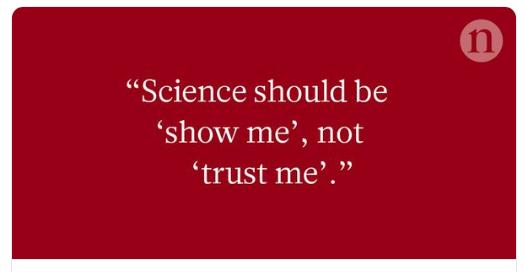

```{r setup, include=FALSE}
options(htmltools.dir.version = FALSE)
```

# Acknowledging

R-Ladies Melbourne for the invitation to speak   

R-Ladies community - welcoming and inclusive

---
```{r echo=FALSE}
knitr::include_graphics("https://medicine.unimelb.edu.au/__data/assets/image/0008/2892185/varieties/medium.jpg")
```

[Genomic Platform Group](https://umccr.org/)

Focus  
- managing genomics data to improve cancer patient care
- open source software development

---
```{r echo=FALSE}
knitr::include_graphics("data/reproducibility.png")
```
# First goal of this talk!

<blockquote class="twitter-tweet"><a href="https://twitter.com/trevorabranch/status/648987799648014336"></a></blockquote>


**reproducible** and **transparent** and **reuseable**

---
# 



.center[]

---

background-image: url("https://media.giphy.com/media/f4FKTFwMXn1za/giphy.gif")
background-position: 50% 50%
class: center, inverse

# Second goal of this talk!

Inspired and confident to dive in!


---

# Assumptions

* You are using RStudio (Integrated Developer Environment)

* You have heard of git

* Familiar with HTML and CSS

---
class: center, inverse, middle

# The evolution of reproducibility in R

---

```{css, echo = FALSE}
@import url(https://fonts.googleapis.com/css?family=Permanent+Marker);
```


# In the beginning, there was LaTeX

<span style="font-family:Permanent Marker">In the early 1980's, LaTex was released.  
[Latex](http://nitens.org/taraborelli/latex) is a document preparation system.  
Plain text + markup = defined structure (article, letter, bibliography)

--

Perfect for those who **really** care about typeface:


_`Kerning is the process of selectively adjusting the spacing between letters pairs to improve the overall appearance of text.`_

---

# In the beginning, there was Sweave

Early 2000's, along came Sweave.

A function that enables integration of R code into LaTex documents

--

The purpose is [_"to create dynamic reports, which can be updated automatically if data or analysis change"._](http://leg.ufpr.br/lib/exe/fetch.php/projetos:obesidade:sweave-rnews-2002-3.pdf)

--

1. Run each R script

--

2. Then run latex

--

3. then run bibtex

--

4. then run latex again

--

5. generates a pdf


---

# In the beginning, there was GNU

GNU
1. Create a [makefile](https://kbroman.org/minimal_make/examples/ex1/Makefile)
2. type *make*

--

* make will only rebuild anything that has been altered  

--

* first true example of reproducible research

See Karl Broman (https://kbroman.org/minimal_make/) for a fantastic tutorial.

---

# Sweave is dead, long live knitr!

knitr is Sweave reborn!  


* knitr - packing in the goodness of Sweave alongside readable code

* knitr uses Rmarkdown, a set of intuitive human-readable code for formatting

* knitr supports many languages - Python, [Julia](https://cran.r-project.org/web/packages/JuliaCall/vignettes/Julia_in_RMarkdown.html), C++, SQL

* knitr can produce html, pdf, and word

* Rmarkdown has a restricted set of commands, and there is no way to create custom commands, however custom LaTeX can be included

---

# Rmarkdown, easy peasy lemon squeezy

A flavour of Markdown specifically for R.

Rmarkdown = documentation language (.md) + programming language (R),  
knit them together with knitr

--

Three main sections:
* YAML header
* code chunks
* markdown text


---

# [YAML](https://yaml.org/spec/current.html) (rhymes with “camel”)

YAML is human-friendly, cross language, text.

This block allows you to fine-tune the output of your document.
YAML metadata allows for:
- TOC, tabbed sections, theme, highlight
- allows for custom CSS
- can evaluate R expressions, e.g. Sys.time()


---

# [Code chunks](https://www.rstudio.com/wp-content/uploads/2015/03/rmarkdown-reference.pdf)


*three backticks{r chunk_name, options}*  
*code!*   
*three backticks*

Common options:
* include (FALSE) - prevents code and results from appearing
* echo (FALSE) - include results (e.g. figures) but exclude the code
* message (FALSE) - prevents messages generated by code from appearing
* warning (FALSE) - as above but for warnings
* fig.cap - add captions to graphics
---

# Rmarkdown

Advantages of RStudio:  
(File -> New Project -> New Directory -> New Project)

* Self contained and portable
* Working directory set to root of project on launch
* Fresh session everytime the project is launched 

--

File -> New File -> R Markdown  

Chunks:  
* Infrastructure - environment (e.g. libraries), loading data, defining analysis parameters
* Wrangling - code to transform data
* Communication - e.g. data visualization, summary tables

---

# Rmarkdown - best practices

* Do not hardcode paths! - use [here](https://github.com/jennybc/here_here)

--

* Do not hardcode values! - use parameters

--

* Do not do everything in Rmarkdown (e.g. database queries)

--

* [Do not litter!](https://emilyriederer.netlify.com/post/rmarkdown-driven-development/)

--

* Reduce duplication with functions

---
# Reversible reproducible

<blockquote class="twitter-tweet"><a href="https://twitter.com/noamross/status/1127273301443850240"></a></blockquote>


---
# Report - example from UMCCR

  <iframe src="https://drive.google.com/file/d/1mgkd32OPQGCRgE4H4gnel53dH_SRUtlK/preview" width="640" height="480"></iframe>

---

# Producing a book

“If you can type words, you can use bookdown”  
-@CivicAngela, RLadiesChicago

--

(yay!) write and publish a book

--

(boo!) tables can be ugly!

--

(boo!) collaboration can be hard

---

# Bookdown

.pull-left[

]

.pull-right[

]

---


``` {r, echo=FALSE, out.width="15%", fig.align="right"}
knitr::include_graphics("https://pbs.twimg.com/media/D3LbQ46XoAEfqkU.png")
```

# Going one step further

## Why do we like workflowr?

Helps scientists organise their research in a way that promotes:
- reproducibility  

--

- collaboration/sharing of results  

--

- effective project management

--

Combines literature programming **and** version control

A website, containing **time-stamped**, **versioned**, and **documented** results


---
```{css, echo = FALSE}
.remark-code {
  font-size: 17px;
}
```
# workflowr in a nutshell

Tip - don't start with the "Quick Start"  
Instead begin with https://jdblischak.github.io/workflowr/articles/wflow-01-getting-started.html

```{r eval=FALSE, tidy=FALSE}
library(workflowr)
wflow_git_config(user.name = "yourGitHub_username", user.email = "youremailaddress")
wflow_start("MyProject")
# this creates the directory structure
# 2 key folders: 
# analysis/ - holds the .Rmd files
# docs/ - holds the .html files and any generated figures
# 
# data/ - for raw data files
# code/ - for additional code, e.g. for pre-processing the data
# output/ - for code results
```

---

# workflowr in a nutshell (cont.)

```{r eval=FALSE, tidy=FALSE}
wflow_view()
wflow_build()
# makes the .html files from the .Rmd files
wflow_view()
wflow_status()
wflow_publish(c("analysis/index.Rmd", "analysis/about.Rmd", "analysis/license.Rmd"),
              "Publish the initial files for MyProject")
wflow_status()
wflow_use_github("yourGitHub_username", "MyProject")
# create the GitHub repository MyProject
wflow_git_push(dry_run = TRUE)
# ok?!
wflow_git_push()

# do some stuff

wflow_build()
# makes the .html files from the .Rmd files
wflow_view()
wflow_status()
wflow_publish(c("analysis/index.Rmd", "analysis/about.Rmd", "analysis/license.Rmd"),
              "Publish the initial files for MyProject")
wflow_status()
wflow_use_github("yourGitHubusername", "MyProject")
# create the GitHub repository MyProject
wflow_git_push(dry_run = TRUE)
# ok?!
wflow_git_push()
```


---

# why workflowr

* Creates a structured directory (consistency!, yay!)  
(keeps data, methods and outputs separate)

--

* Diffability - the ability to see how an analysis has changed over time  

--

* Git for the petrified!

--

Note that **only** workflowr RMD files can sit in the `analysis` folder.

Once you are comfortable with the basics, got nuts with customisation.  
e.g. https://github.com/timtrice/workflowr_skeleton


---

# In addition

Building on workflowr, use community-recognised structures:
- .R scripts in scripts/
- tests in tests/

use assertr to check 

**Making data accessible**:  
- sharing tidy, standardized, reproducible  data sets for publications and collaborations can be challenging.  
read https://ropensci.org/blog/2018/09/18/datapackager/
- piggyback - attach files (up to 2gig) to a GitHub release
- also [rdrop2](https://github.com/karthik/rdrop2) [rboxr](https://github.com/r-box/boxr)
  
Caveats - see https://github.com/ropensci/DataPackageR - e.g. small size of data  
https://rstudio.github.io/packrat/ - Create and manage a per project library of packages

An R-focused pipeline toolkit for reproducibility and high-performance computing (snakemake)

usethis - automate common tasks

datamaid

drake 
Data Frames in R for Make
R-centric make
- (interactive) dependency graph!

Link everything up to CI

Isolate your computing environment


Docker
- [containerit](https://github.com/o2r-project/containerit) - can take an arbituary and generate a docker file
- Jupyter Project - repo2docker

With a docker file
BinderHub - can lauch a live notebook from any GitHub repo
All packages installed, all code, all data

---

# R in production - *it will work just fine ...*
(HT @_ColinFay)

Defining production:

_"Software environments that are used and relied on by real users with real consequences if things go wrong"_ 

_"Production is anything that is run repeatedly and that the business relies on"_

--

* No real/private/patient data in dev environments  

--

* Dev is **not** for long-term or stable work, could be wiped at any time  

--

* Production is real data, stable services/tools/workflows, tight(er) access control

---
# R in production

* documented
* with tests
* list dependencies
* work everywhere


---

# Running RStudio in AWS

Via the AWS Management Console:

EC2 +

--

Configure the security groups for port 80 and 8787

--

Install R

--

Install RStudio

--

Create a user for RStudio

--

Point the public DNS (IPv4) at the correct port, and bingo!

--

Can bypass installation by using [RStudio Amazon Machine Image](http://www.louisaslett.com/RStudio_AMI/)

---

# AWS tips

1. use a bastion account

--

2. pay attention to IAM

--

3. log into EC2 instances via the AWS SSM Session Manager - no SSH key handling and fully audited.

--

4. Programmable, **repeatable** infrastructure - infrastructure as code (IaC) - helps with resource management and tracking changes.

---
# The abc of presentations

*Cool kids will dump their xaringan slides online and never bring a usb stick to their group meetings.* - [Yihui Xie](https://yihui.name/en/about/)

--

- Create a new repository in GitHub: *my_awesome_R_talk*  
(share the love, make it public)

--

- Clone

--

- Open RStudio in this repo

--

- Install the **xaringan** package from [Github](https://github.com/yihui/xaringan):

```r
devtools::install_github("yihui/xaringan")
```

--

- Create a new R Markdown document from the menu `File -> New File -> R Markdown -> From Template -> Ninja Presentation`

--

- Click the `Knit` button to compile it;

--

- `git status, git add, git commit -m, git push`

--

- GitHub -> Settings -> GitHub Pages

---
# Resources


* For learning xaringan, massive thanks to Allison Hill:  
https://alison.rbind.io/slides/rladies-demo-slides.html#1
https://github.com/rbind/apreshill/blob/master/static/slides/rladies-demo-slides.Rmd
https://alison.rbind.io/post/r-ladies-slides/

* Learn xaringan thanks to [Allison Hill](https://github.com/rbind/apreshill/blob/master/static/slides/rladies-demo-slides.Rmd)
* https://github.com/yihui/xaringan/blob/master/inst/rmarkdown/templates/xaringan/skeleton/skeleton.Rmd
*
http://reproducibleresearch.net/how-to-make-a-paper-reproducible/
